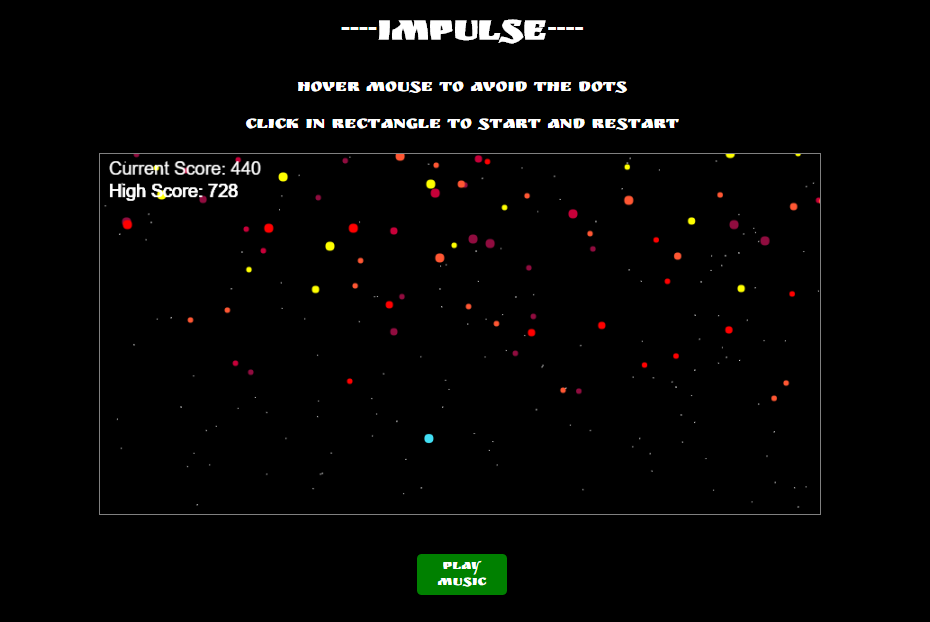

# Impulse

[Live Site](https://natereiners.github.io/);

Impulse is a simple and surprisingly addictive game built using JavaScript, HTML5 Canvas and EaselJs.  The rules are as follows.

1) The user must avoid all obstacles which move across the screen from top-right to bottom left.
2) The game ends when the user hits an obstacle.

## Features

###Intuitive Gameplay

The user's position is controlled by simply hovering the mouse over the canvas element. This game is easy to get the hang of, even if you don't know the rules or the controls at first.

###Current Score and High Score

The users current score is displayed in the upper left hand corner of the canvas element, along with their highest score. The high score is stored under a key I created in the browsers local storage so it will persist even after closing the browser and returning to the page.

###Elegant Styling and Sound

####Styling
Using Javascript with Easel.js to draw on the canvas element, I opted to give this game a clean look in an attempt to let the user be immersed in gameplay. The users glowing orange 'comet-tail' and starfield in the background were fun to make and add a bit of style.  

####Sound
I added a 'game over' sound to this game as well as optional background music which is off by default, but can be turned on at the click of a button.

### Technologies

This is a purely front-end project created with the following technologies.

- Vanilla JavaScript for overall structure and game logic,
- `Easel.js` with `HTML5 Canvas` for DOM manipulation and rendering,
- Webpack to bundle and serve up the various scripts.
