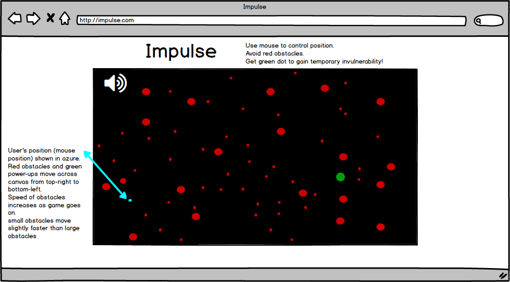

## Impulse

### Background

Impulse is a simple and surprisingly addictive game. The rules are as follows.

1) The user must avoid all obstacles which move across the screen from top-right to bottom left.
2) The game ends when the user hits an obstacle.
3) As the game progresses, the obstacles move at a faster and faster rate.

### Functionality & MVP  

I will include the following features in Impulse:

- [ ] Start game upon on clicking anywhere on canvas.
- [ ] Allow user to control position using the mouse.
- [ ] Make obstacle dots move from top-right to bottom left, increasing speed slightly every 10 seconds.

This repo will also include.

- [ ] A production Readme

### Wireframes

This app will consist of a single screen with an obstacle field and links below it to my Github and LinkedIn.

### Architecture and Technologies

This project will be implemented with the following technologies:

- Vanilla JavaScript and `jquery` for overall structure and game logic,
- `Easel.js` with `HTML5 Canvas` for DOM manipulation and rendering,
- Webpack to bundle and serve up the various scripts.

In addition to the webpack entry file, there will be two scripts involved in this project:

`board.js`: this script will handle the logic for creating and updating the necessary `Easel.js` elements and rendering them to the DOM.

`object.js`: This will include code for all objects. Each `Object` will contain a `type` (user, obstacle or power-up).

### Implementation Timeline

**Day 1**: Setup the basic project structure and figure out how to use Easel.js. Get something rendering on the screen.

- Get something showing up on my canvas.
- Figure out more of the details about what I need to learn to code this game.

**Day 2**: Continue learning about how to use Easel.js. Ideally by the end of the day I will have figured out how to move an object around the screen by hovering my mouse over the canvas and how to control the number, size and speed of obstacles.

- Complete the object.js module (constructor, update functions)
- Render a circle to the canvas using Easel.js
- Make a circle follow the users mouse.
- Make obstacle objects which fly across the screen.

**Day 3**: Figure out collision logic and fine-tune obstacle speed. Figure out how to increment it slightly.

- Figure out how to lose the game by having one obstacle and one 'user' object for testing.
- Add as many obstacles as needed.

**Day 4**: Style the frontend.

- Make sure 'user' object lags slightly behind mouse if mouse is moving too fast.
- Have a styled canvas and nice title
- Time permitting: complete bonus features

### Bonus features

Time permitting, I'd like to implement the following features. Some anticipated updates are:

- [ ] Give 'user' object a tail which traces previous movementstat
- [ ] Change the colors of background and obstacles.
- [ ] Add bonus which gives vulnerability for a limited amount of time.
- [ ] Add bonus which immediately destroys all obstacles on page.
